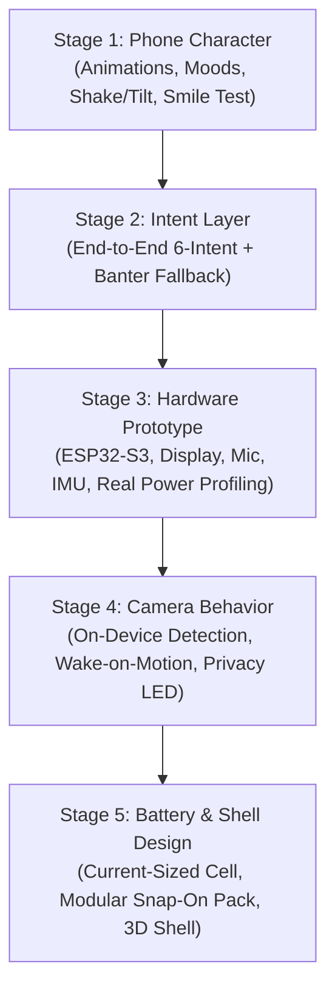

# Physical AI Companion — Master State & Specification

> **NOTE FOR ANY AI ASSISTANT / RESUMED CONVERSATION**:
> This document is the single source of truth for the Physical AI Companion project. Read this file completely to understand 100% of the project vision, technical architecture, current progress, and immediate next steps. Do not start from scratch or re-invent fundamentals.

---

## 1. Project Vision & Philosophy

- **Product Concept**: A tiny, lightweight, keychain-sized physical AI companion device with a display covering most/all of its visible front (cube form-factor).
- **Core Mantra**:
  - **UTILITY** gets the device used.
  - **PERSONALITY** makes the user care about it.
- **The Physical Role**: The phone is the main computational hub. The physical device is the companion's:
  - Face & Eyes (OLED display, expressive procedural character)
  - Ears & Microphone (beat detection, ambient listening)
  - Physical Presence (on keys or desk, glanceable, always alive)
- **Ultimate Project Goal**: Build a real prototype → put it in people's hands → validate demand → **sell the first unit**.

---

## 2. Character Persona & Interaction Paradigm

- **Personality Type**: **Expressive / Non-verbal (Tamagotchi / Wall-E / Pokémon style)**.
  - Expressive animated eyes/face, procedural chirps/beeps/purrs, body language, glanceable icons.
  - Not an annoying voice assistant; an ambient living creature.
- **Core Interaction Layers**:
  1. **Ambient & Reactive (Always-on)**:
     - Follows user's face/gaze using camera.
     - Head-bobs and pulses to music beat automatically.
     - Emotively alerts on phone events (messages, calls, timers).
     - Sleeps when dark/alone, wakes up when user appears.
  2. **Tactile & Shake-to-Control (Hero Control UX)**:
     - **Shake the cube**: The character morphs into media controls:
       - **Left Hand** = `⏮ Previous`
       - **Body / Belly** = `⏯ Play / Pause`
       - **Right Hand** = `⏭ Next`
     - Tapping the respective zone fires the command with squishy visual feedback.
  3. **Life State & Evolution (Tamagotchi Layer)**:
     - Internal states: Attachment level, Energy, Boredom, Temperament.
     - Persists to disk; evolves based on how the user interacts over days.

---

## 3. Technical & AI Architecture

### 90–95% Deterministic / Specialized ML vs 5–10% SLM Reasoning
- **Deterministic & Fast (~90–95%)**:
  - 60 FPS Procedural Character Eye Renderer & Saccades (PySide6 / OpenGL).
  - Face / Iris tracking (OpenCV / MediaPipe).
  - Audio FFT / Beat onset detection (PyAudio / sounddevice / numpy).
  - FSM State transitions (Sleep, Idle, Engaged, Grooving, ControlMode, Alert).
- **Dual-Lane Routing Architecture**:
  1. **Fast Deterministic Lane (~90%)**:
     - Direct hardware actions: `NEXT_TRACK`, `PREVIOUS_TRACK`, `TAKE_PHOTO`, `SET_TIMER`.
     - Zero generative latency; executes action immediately with snappy visual/audio feedback.
  2. **AI Personality Lane (~10%)**:
     - Both `CONVERSATION` and unmapped/open-ended queries flow here.
     - **The companion NEVER tells the user "UNKNOWN" or emits robotic errors.**
     - `UNKNOWN` is purely an internal safety flag meaning *"do not touch camera or media controls"*. The character responds in playful persona, witty banter, or thoughtful deflections.
- **SLM Subconscious (~5–10%)**:
  - Model: `SmolLM2-135M-Instruct` or `SmolLM2-360M-Instruct` (Unsloth / local QLoRA).
  - Runs **asynchronously in the background** every 15–30s or on conversational triggers.
  - Acts as the "subconscious director": generates inner thoughts, adjusts mood bias, picks spontaneous micro-actions, handles rare natural language queries.

---

## 4. Five-Stage Product Development Roadmap



### Stage 1: Phone Character (The "Smile Test" & Emotional Core) — *(COMPLETE - KITSUNE FOX SPIRIT CUB WEB PWA)*
- **Goal**: Validate that the creature generates genuine, spontaneous user delight (*"The Smile Test"*) before manufacturing hardware.
- **Status**: **Fully built and running as a zero-dependency, full-bleed mobile PWA in `web/`**:
  - `web/species/fox.js`: Modular species architecture isolating creature rendering. Features a mythic fox-spirit cub (kitsune) with warm orange/cream palette, independently driven ears (perked, flat, droopy, one-up-one-down), 5-segment spring-chain tail with follow-through lag (wag, puff, curl, swish), glowing kitsune forehead crest, sparkling tail tip, ambient orbiting spirit wisps (*kitsune-bi*), and pure Canvas vector emotes (`!`, `?`, `♥`, `♪`, `✨`, `💤`).
  - `web/character.js`: 60 FPS HTML5 Canvas 2D engine coordinating second-order spring physics, eye saccades/blinks, modular species rendering, and the 3-zone Shake-to-Controls morph layout (`⏮`, `⏯`, `⏭`).
  - `web/reactions.js`: Cancel-token async step runner, direct touch gestures (body poke, ear tap, tail tap, pet hold, stroke drag, flick fling), autonomous life micro-behaviors (look around, yawn, stretch, chase tail, sneeze wisp, ear twitch), 30s sleep watchdog, and dynamic wake (grumpy vs happy).
  - `web/sensors.js`: Direct touch hit-testing, drag/stroke detection, quick flick velocity detection, hardware `devicemotion` shake & `deviceorientation` tilt/flip, desktop keyboard shortcuts (`S`, `F`, `L`, `R`, `Z`), and a single-tap friendly motion permission unlock screen.
  - `web/smiletest.js`: Unobtrusive bottom strip prompt appearing 2.2s after interactions and auto-fading after 7s, persistent `localStorage` tally, time-to-first-smile stopwatch, JSON telemetry export, and clean URL modes (`?dev=1` for dev tools, default and `?test=1` for pure creature).
  - `web/sw.js`: PWA Service Worker (v2) caching all assets for offline execution.
  - `web/screenshots/`: Automated headless browser verification captures of all 10 moods and key gestures/reactions.

### Stage 2: Intent Layer (Deterministic + Banter Fallback)
- **Goal**: Zero user confusion; snappy (<50ms) action execution; 0% robotic error rates.
- **Key Modules**:
  - 6-Intent Classifier: `NEXT_TRACK`, `PREVIOUS_TRACK`, `TAKE_PHOTO`, `SET_TIMER`, `CONVERSATION`, `UNKNOWN` (internal safety code only).
  - **Zero "UNKNOWN" rule**: The user is NEVER shown an error message or "unknown" prompt. Unmapped queries route directly to personality banter and playful deflections.
  - End-to-end integration: Audio mic stream -> ASR / keyword intent -> hardware action -> expressive feedback.
  - Dataset hardening: 315+ structured semantic state samples with ASR homophone noise and duration parameter extraction.

### Stage 3: Hardware Prototype (ESP32-S3 & Real Power Profiling)
- **Goal**: Build physical breadboard/devkit prototype and empirically measure real milliamp (mA) current draw.
- **Key Modules**:
  - Dev Board: **ESP32-S3-WROOM-1 / ESP32-S3-Korvo-2** (Dual-core Xtensa LX7 @ 240MHz, 8MB PSRAM, Wi-Fi 4 + BLE 5.0).
  - Display: 1.28" or 1.54" round/square SPI display (GC9A01 / ST7789, 240x240 RGB).
  - Microphone: I2S digital MEMS microphone (INMP441 / MSM261D).
  - Accelerometer / IMU: 6-axis I2C sensor (MPU6050 / LSM6DS3) with hardware interrupt pin.
  - **Empirical Power Profiling**: Measure actual current draw with Nordic Power Profiler / multimeter across 3 states:
    1. *Deep Sleep / Motion Wake*: Target < 50 µA.
    2. *Ambient Idle / Glance*: Target ~20–35 mA (low CPU clock, dimmed screen).
    3. *Active Perception (Camera + Audio + Wi-Fi)*: Target ~180–280 mA.
  - Real battery sizing: Determine required mAh based on measured duty cycle (e.g. 16h waking day vs. 3-day standby).

### Stage 4: Camera Behavior (Privacy, Vision & Wake)
- **Goal**: Socially acceptable ambient camera with zero privacy paranoia and instant motion wake.
- **Key Modules**:
  - Camera Sensor: OV2640 / OV5640 DVP camera module.
  - Edge Inference: ESP-WHO / ESP-NN quantized face detection on-device; raw video never leaves the device.
  - Wake-on-Motion: Accelerometer tap/motion interrupt wakes ESP32 from deep sleep in < 250ms.
  - **Physical Privacy LED**: Hardware indicator LED wired directly in series with the camera sensor power / VSYNC line so users and bystanders have physical, unhackable verification of when the sensor is active.

### Stage 5: Battery & Shell Design (Industrial Design & Snap-On Pack)
- **Goal**: A pocketable, durable, lovable keychain cube with modular power.
- **Key Modules**:
  - Cell Sizing: Select high-density LiPo / LiFePO4 cell sized precisely to the Stage 3 power measurements.
  - Modular Snap-On Pack: Magnetic pogo-pin battery backpack allowing the core companion to stay ultra-lightweight on keys while snapping onto a larger desk dock or battery pack.
  - 3D CAD Shell: Injection-molding / SLA resin casing with matte soft-touch finish, screen lens bezel, mic acoustic port, camera aperture, and reinforced metal lanyard/keychain eyelet.

## 5. Completed MVP Demonstration Architecture

1. **Perception**:
   - Neural Face Tracker (OpenCV YuNet DNN): detects person arrival (`PERSON_DETECTED`) and continuously tracks gaze vector in 3D.
   - Microphone Speech Recognition (`SpeechRecognition` + `pyaudio`): live voice listening in background.
   - Interactive Dev Console: one-click utterance buttons, custom typing bar, simulated phone events, keyboard gestures (`[S]` shake).
2. **Intent Engine**:
   - 6-class deterministic intent classifier (`NEXT_TRACK`, `PREVIOUS_TRACK`, `TAKE_PHOTO`, `SET_TIMER`, `CONVERSATION`, `UNKNOWN`) with parameter extraction (timer seconds).
3. **Actions**:
   - Song skip: advances playlist, updates memory, triggers system `playerctl`.
   - Take photo: captures frame and saves to `photos/photo_*.jpg`.
   - Set timer: real countdown timer ticking every second with audio alarm and notification on completion.
4. **Light Theme & Character Anatomy (V3 Colorful Edition)**:
   - **Light Theme Architecture**:
     - *Simulator Bezel*: Ceramic pearl off-white casing (`#F8FAFC`, border `#CBD5E1`) with 44px rounded corners.
     - *Screen Canvas*: Crisp modern light display surface (`#FFFFFF` to `#F1F5F9`, border `#E2E8F0`).
     - *Dev Phone Console*: Styled in matching clean light theme with white group cards and vibrant `#0284C7` accents.
     - *Dialogue Bubble*: Floating white pill card with soft drop shadow, `#0284C7` border, and crisp `#0F172A` text.
   - **Vibrant Character Anatomy**:
     - *Chassis / Torso*: Vibrant, cheerful Sky-Blue gradient (`#38BDF8` -> `#0EA5E9` -> `#0284C7`) with glossy curved head highlight arc and ambient drop shadow.
     - *Belly Patch*: Soft creamy rounded tummy (`#FFFFFF` to `#F0F9FF`, border `#BAE6FD`).
     - *Chest Core / Heart Gem*: Glowing pulsing rosy ruby power gem (`#FF6B8B` -> `#F43F5E`) centered in belly patch.
     - *Rosy Cheeks*: Soft blushing pink ovals (`#FB7185`) under eyes that pulse warmly with emotion.
     - *Expressive Eyes*: Deep glossy sapphire irises with electric cyan rims, bright dual specular shine highlights (Pixar/anime life spark), and curved joyful crescent `^ ^` eyes on happy/greetings.
     - *Animated Mouth*: Warm ruby lips (`#E11D48`) with soft pink tongue (`#FDA4AF`) when talking; curves into cheerful smile, flat pout, or open gasp.
     - *Hands & Paws*: Floating rounded pill mittens in matching sky-blue with soft white palm pads and rosy center dots. Right hand waves enthusiastically on greetings (`trigger_wave`).
     - *Legs & Boots*: Rounded deep azure boots beneath chassis with crisp white/cyan sole treads, tapping to audio beats.
     - *Ear Caps*: Golden amber headphone nubs (`#F59E0B`) with glowing mint LED centers on the sides of the head.
5. **Templates (No Generative Hallucination, Clean Fallbacks)**:
   - `NEXT_TRACK` -> "Skipping that one..." -> annoyed animation
   - `TAKE_PHOTO` -> "Say cheese! *click*" -> camera shutter flash
   - `SET_TIMER` -> "Timer set for {duration}!" -> attentive animation
   - `CONVERSATION` -> "Entertain yourself, mortal! Or tap my belly." -> cheeky animation
   - `PERSON_DETECTED` -> "I see you!" -> perked_up animation
6. **Basic Memory & Context**:
   - Stores current song, recent command history, active timer countdown, persistent preferences (`data/companion_memory.json`).
7. **Phone Bridge & Event Simulator**:
   - Simulates external phone push alerts (WhatsApp messages, incoming phone calls, low battery).
   - Routed cleanly via `process_phone_event()`, triggering contextual character dialogue reactions and procedural chime SFX without crashing intent classifier.

---

## 6. AI Model, Training Setup & Structured Semantic State

### Strict Semantic State Schema
Downstream consumers and the Behavior Engine receive a strict, deterministic schema:
```json
{
  "primary_intent": "NEXT_TRACK",
  "confidence": 0.96,
  "intent_scores": {
    "NEXT_TRACK": 0.96,
    "PREVIOUS_TRACK": 0.01,
    "TAKE_PHOTO": 0.01,
    "SET_TIMER": 0.01,
    "CONVERSATION": 0.01,
    "UNKNOWN": 0.00
  },
  "emotion": "annoyed",
  "attention": "user",
  "energy": 0.75,
  "parameters": {
    "duration_sec": null
  }
}
```

### Models & Training
- **Supported Models**: IBM Granite 4.0 / 3.0 (`ibm-granite/granite-4.0-micro-instruct` or `granite-3.0-1b-a400m-instruct`) or `unsloth/SmolLM2-135M-Instruct`.
- **Directory Layout**:
  - `ai/datasets/intent_train.jsonl` — 315+ records with full `semantic_state` targets, ASR noise, and duration slots.
  - `ai/datasets/intent_eval.jsonl` — 120 held-out evaluation records with full `semantic_state` targets.
  - `ai/training/train_unsloth.py` — QLoRA training script using native `tokenizer.apply_chat_template`.
  - `ai/evaluation/eval_suite.py` — Benchmark suite computing Confusion Matrix, Precision, Recall, and F1.
  - `ai/models/` — Saved LoRA checkpoints.

---

## 7. Current Project File Layout

```
ai-companion/
├── COMPANION_STATE.md       # Master specification and state
├── run_companion.py         # Main entry point for Full MVP
├── ai/
│   ├── datasets/
│   │   └── intent_train.jsonl  # Training dataset for Unsloth
│   └── training/
│       └── train_unsloth.py    # Unsloth fine-tuning script (SmolLM2-135M)
├── photos/                  # Saved webcam photos from TAKE_PHOTO
├── data/                    # Persistent memory & life state JSONs
└── src/
    ├── speech/              # Speech recognition listener (PyAudio + SR)
    ├── intent/              # 6-class intent classifier & parser
    ├── actions/             # Real actions (Music skip, photo save, timers)
    ├── templates/           # Personality templates & expression mappings
    ├── memory/              # Context memory (song, timer, command history)
    ├── renderer/            # 60 FPS Procedural OLED display & SFX
    ├── perception/          # Neural face tracking & audio beat detector
    └── phone_bridge/        # Dev test console & phone simulator
```
